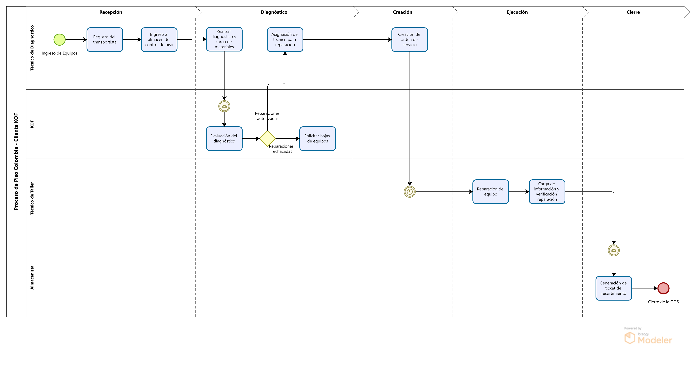

# Servicios piso colombia KOF

## Recepción

### Registro del transportista

Los equipos llegan al taller y se registra el ingreso en PS9 con información como la unidad de negocio, la placa del vehículo, el nombre del transportista y el cliente.

### Ingreso a almacen de control de piso

Los equipos se clasifican en diferentes estados y se dan de alta en los inventarios de control de piso de PS9. Los posibles estatus de los equipos son los siguientes:

- Nuevos: Equipos recién fabricados o importados, que se almacenan en espera de utilización.
- Emplayados: Equipos que han salido para instalación pero no se pudieron instalar por diversas razones.
- Almacenados: Equipos reparados que esperan ser utilizados.
- Usados: Son los equipos que llegan directamente a reparación a taller.

:::warning[Puntos a resolver]

- ¿Como se realiza la captura de las placas de los equipos? Manualmente? Lectura de código?
  :::

## Diagnostico

### Realizar diagnostico y carga de materiales

Para los equipos que se ingresan _Usados_, se realiza un diagnóstico para determinar las reparaciones necesarias. Se cargan los repuestos necesarios para la reparación del equipo, según el diagnóstico inicial y se pasa a un estado de "pendiente de aprobación".

El diagnóstico, con la lista de materiales y costos, se entrega al personal de KOF en un formato impreso para su evaluación

### Evaluación del diagnóstico

El personal de KOF revisa el diagnóstico y decide si se aprueba o se rechaza la reparación, considerando los costos y condiciones físicas del equipo.

### Asignación de técnico para reparación

Si el diagnostico y la reparación se aprueban, se procede a la asignación de un técnico y a la creación de una orden de servicio.

:::warning[Puntos a resolver]

- Detallar los escenarios donde la reparación no es autorizada
- ¿Que criterios se usan para la asignación del técnico?
  :::

## Creación

La creación de servicios se puede hacer de forma individual o de forma masiva capturando la informacion:

- IdSet que corresponde a la unidad de cada uno de los países
- La unidad de negocio de cada una de las ciudades
- La información del cliente
- El taller donde se está realizando la reparación

:::warning[Puntos a resolver]

- ¿Cantidad de sucursales en colombia?
- ¿Cantidad de personas con role de auxiliar técnico?
- ¿Cantidad de servicios creados promedio por semana/mes/año?
  :::

## Ejecución

### Reparación de equipo

Se repara el equipo y se captura la misma información de las órdenes de servicio de ruta, variando el Id del tipo del servicio a 1002.

### Carga de información

Durante la reparación se verifica el Voltaje y el Amperaje, mismos que se captura en PS9 con el listado de Actividades, Gastos, Materiales, Fecha y Hora de reparación para calcular tiempos

> A diferencia del servicio de Ruta, no se habilita las imagenes para la firma y las imágenes de evidencia

:::warning[Puntos a resolver]

- ¿Como se lleva el orden de los servicios que atiende el técnico de reparación? ¿En orden de registro?
  :::

## Cierre

### Generación de ticket de resurtimiento

El almacenista genera el de Ticket del Resurtimiento

> En comparación a ruta donde cada técnico tiene su propio almacén, en piso se utiliza un solo almacén.
