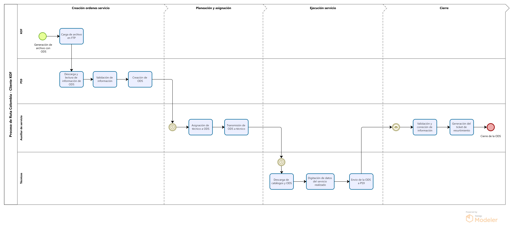

# Servicios ruta colombia KOF

## Creación

### Carga de archivo en FTP

El proceso comienza cuando KOF solicita servicios de ruta. Estas solicitudes se generan en SAP y se exportan a un archivo a un servidor FTP donde son leidos por PS9 usando una interfaz de precarga masiva

### Descarga y validación de información de ODS

PS9 descarga y lee el archivo de texto del servidor FPT usando una interfaz de precarga masiva y aplica las validaciones a los datos de cada ODS

### Creación de ODS en PS9

PS9 genera generar las ordenes en estado _abierto_ y se le asigna un número de identificación, junto con la información del cliente, datos de facturación y las fechas relevantes.

:::warning[Puntos a resolver]

- ¿Cuales son los datos incluidos en cada ODS? Resolver con los casos de uso establecidos por Colombia
- ¿Que validaciones se aplican sobre los datos?
- ¿Como se procede con las ODS con datos incompletos o incorrectos?
- ¿Cantidad de servicios creados promedio por semana/mes/año?
  :::

## Planeación

### Asignación de técnico a ODS

La asignación del técnico a la orden de servicio es un paso crucial en el proceso de gestión de órdenes. Esta asignación se realiza a través del módulo de PS9, donde se selecciona el técnico adecuado para la orden de servicio.

### Transmisión de ODS a técnico

Después de la asignación, la orden de servicio se transmite al dispositivo móvil del técnico. Esta transmisión puede ser masiva o individual, dependiendo de la cantidad de órdenes.

El técnico recibe las órdenes en su dispositivo y valida las asignaciones, revisando qué órdenes tiene en estado "abierto".

:::warning[Puntos a resolver]

- ¿Cantidad de sucursales en colombia?
- ¿Cantidad de personas con role de auxiliar técnico?
- ¿Quien asigna la sucursal responsable de cada servicio?
- ¿Existen criterios establecidos para la selección de ténico?
  :::

## Ejecución

### Digitación de datos del servicio realizado

El técnico procede a ingresar información relevante sobre la orden de servicio, como el modelo, la marca, la categoría y el número de activos, asegurándose de que los datos estén actualizados.

Tambien gestiona la orden de servicio registrando las actividades realizadas y cualquier material utilizado.

### Envio de la ODS a PS9

Al finalizar el servicio, el técnico cierra la orden y la transmite nuevamente al sistema, donde se registra como _finalizada_

## Cierre

### Recepción y validación de información

El auxiliar de servicio recibe la orden de servicio en estado "finalizado". Su tarea es validar la información ingresada por el técnico. El auxiliar revisa la orden para asegurarse de que todos los datos sean correctos. Esto incluye verificar si el técnico digitó correctamente las actividades y los materiales utilizados. Si se requiere algún cambio, el auxiliar puede modificar la información.

### Generación del ticket de resurtimiento

Si el técnico utilizó materiales durante la gestión de la orden, se debe realizar un ticket de resurtimiento para reabastecer el stock del técnico en SAP. Esto implica que el almacenista debe comparar el ticket de resurtimiento impreso con el vale de adeudo para asegurar que coincidan los materiales utilizados.

El almacenista realiza el resurtimiento de los materiales en SAP, asignando nuevamente los materiales al stock del técnico. Esto asegura que el inventario esté actualizado y que el técnico tenga los repuestos necesarios para futuras órdenes.

### Cierre de la Orden de Servicio

La orden no puede ser cerrada hasta que se complete el proceso de resurtimiento y se verifique que todos los materiales utilizados sean correctos. Una vez que el almacenista confirma esto, se procede al cierre de la orden de servicio en el sistema.

:::warning[Puntos a resolver]

- ¿Se genera un archivo de salida con los servicios cerrados?
  :::
